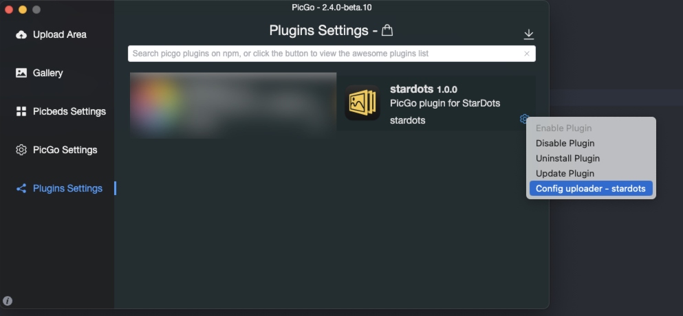
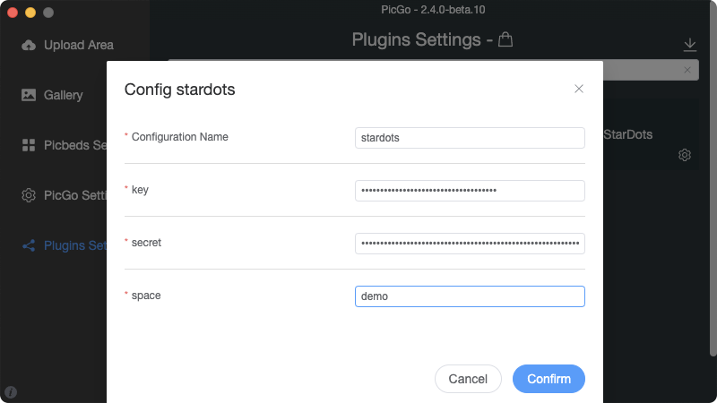
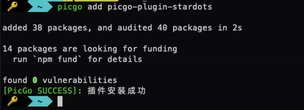

<div align="center">
    <h1></h1>
</div>

# picgo-plugin-stardots  
[](https://npmcharts.com/compare/picgo-plugin-stardots?minimal=true)
[](https://www.npmjs.com/package/picgo-plugin-stardots)
[](LICENSE)  

## Introduction  
PicGo plugin for StarDots  

## Features  
- Upload file(s)  
- Delete remote file(s)  

## Homepage  
[https://stardots.io](https://stardots.io)  

## Documentation  
[https://stardots.io/en/documentation/openapi](https://stardots.io/en/documentation/openapi)  

## Credentials (key and secret)  
[https://dashboard.stardots.io/openapi/key-and-secret](https://dashboard.stardots.io/openapi/key-and-secret)  

## Screenshots  
### Install via gui  

  

  

### Install via cli  

```shell
picgo add picgo-plugin-stardots
```

  